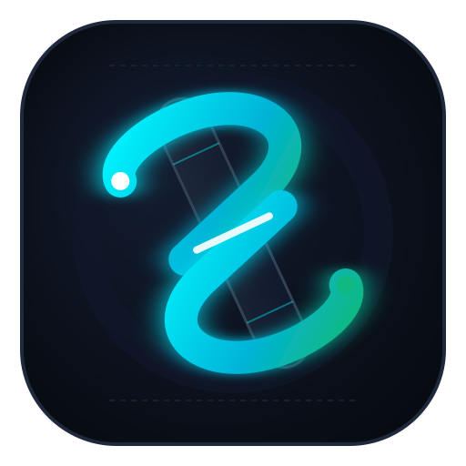

# Scytale Layer-1 Protocol Documentation

<div align="center">
  
  <h3>High-Throughput, Deterministic UTXO Blockchain Protocol</h3>
  <p>Official developer documentation, interactive node inspectors, and CLI handbook for Scytale Devnet.</p>

  <p>
    <a href="https://github.com/ratufatma/scytale"></a>
    <a href="https://github.com/ratufatma/scytale-docs/blob/main/LICENSE"></a>
    <a href="https://github.com/ratufatma/scytale-docs"></a>
    <a href="https://github.com/ratufatma/scytale-docs/actions"></a>
  </p>
</div>

---

## Overview

This repository hosts the official documentation portal and developer resources for the **Scytale Layer-1 Blockchain Protocol**. The portal combines an interactive React developer dashboard with a comprehensive multi-lingual **VitePress** technical specification suite.

### Key Architectural Highlights
- **120-Byte Fixed Header**: Compact binary block header embedding post-state `utxo_root` for instant SPV validation and fail-closed consensus.
- **CPU-Friendly BLAKE3 PoW**: High-throughput SIMD tree hashing ensuring ASIC resistance and true decentralized mining.
- **Deterministic Zero-Float Fee Market**: Pure 64-bit integer arithmetic with atomic fee units (1 SCY = $10^8$ micron).
- **Fast Sync Wire Protocol**: Binary chunked streaming (`getsnap` / `snapshot`) transferring up to 2,000 UTXOs per wire frame.
- **Autonomous DNS Seeder**: Built-in authoritative crawler and dual-stack DNS daemon for cold-start mesh bootstrapping without static peer dependencies.

---

## Multi-Language Coverage

The documentation is available in 7 languages with native RTL support:

| Language | Code | Entry Point |
| :--- | :--- | :--- |
| **English** | `en` | `docs/index.md` |
| **Bahasa Indonesia** | `id` | `docs/id/index.md` |
| **简体中文 (Simplified Chinese)** | `zh` | `docs/zh/index.md` |
| **日本語 (Japanese)** | `ja` | `docs/ja/index.md` |
| **한국어 (Korean)** | `ko` | `docs/ko/index.md` |
| **हिन्दी (Hindi)** | `hi` | `docs/hi/index.md` |
| **العربية (Arabic)** | `ar` | `docs/ar/index.md` |

---

## Getting Started

### Prerequisites
- **Node.js**: `v20.0.0` or higher
- **npm**: `v10.0.0` or higher (or `pnpm` / `bun`)

### 1. Installation
Clone the repository and install dependencies:

```bash
git clone https://github.com/ratufatma/scytale-docs.git
cd scytale-docs
npm install
```

### 2. Development

Launch the interactive developer portal locally:

```bash
npm run dev
```

The portal will be accessible at `http://localhost:3000`.

To run the VitePress technical documentation server independently:

```bash
npx vitepress dev docs
```

The VitePress documentation server will be available at `http://localhost:5173`.

### 3. Production Build

Verify TypeScript compilation and generate the optimized production bundles:

```bash
# Typecheck source files
npm run lint

# Build web application portal
npm run build

# Build static VitePress documentation
npx vitepress build docs
```

---

## Directory Structure

```text
scytale-docs/
├── docs/                     # VitePress markdown specification suite
│   ├── .vitepress/           # VitePress configuration and theme styling
│   │   └── config.mts        # Navigation, i18n locales, and search configuration
│   ├── public/               # Brand assets (logo.svg, favicon.svg, favicon.ico)
│   ├── id/                   # Indonesian localization
│   ├── zh/                   # Chinese localization
│   ├── ja/                   # Japanese localization
│   ├── ko/                   # Korean localization
│   ├── hi/                   # Hindi localization
│   ├── ar/                   # Arabic localization (RTL)
│   ├── architecture.md       # Layer-1 binary specification & state model
│   ├── cli-handbook.md       # scytale-cli operation manual
│   └── getting-started.md    # One-command Docker deployment guide
├── public/                   # Web portal static assets
├── src/                      # Interactive React dashboard application
│   ├── components/           # UI components (DocViewer, Header, Sidebar)
│   └── data/                 # Embedded technical specifications
├── index.html                # Main application HTML entry point
├── package.json              # Project scripts and dependencies
├── tsconfig.json             # TypeScript configuration
└── vite.config.ts            # Vite bundler configuration
```

---

## Community & Resources

- **Core Protocol Repository**: [ratufatma/scytale](https://github.com/ratufatma/scytale)
- **Documentation Repository**: [ratufatma/scytale-docs](https://github.com/ratufatma/scytale-docs)
- **License**: Dual-licensed under [MIT](LICENSE) or [Apache-2.0](LICENSE).
